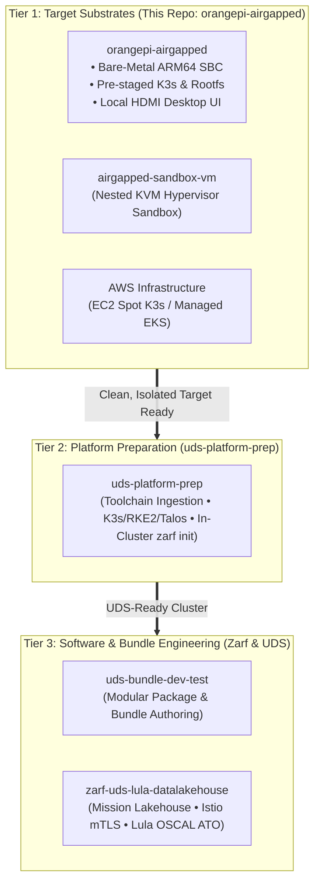

# Orange Pi Air-Gapped Provisioner (`orangepi-airgapped`)

[](#)
[-blue.svg)](#)
[](#)
[](#)

> [!IMPORTANT]
> **Project Status: Alpha**
> This repository is currently in active **Alpha** development. Features, automation scripts, and workflows have been validated on the **Orange Pi 5 Pro** with **Armbian Noble Desktop** and **K3s v1.30.4+k3s1**. Contributions, issue reports, and feedback are welcome.

An automated bare-metal toolchain built to turn low-cost single-board computers (**Orange Pi 5 Pro, 5, 3 LTS**) into standalone, air-gapped **Defense Unicorns UDS** appliances.

It provisions an **Armbian Desktop (ARM64)** base image with native GPU/HDMI support, stages offline **K3s Kubernetes** binaries and container images, and bundles essential CLI tools (`uds`, `zarf`, `kubectl`, `helm`, `k9s`) so you can plug in a monitor, keyboard, and mouse and run UDS directly on the board with zero internet access.

> [!NOTE]
> See [ADR 0001: Migrate Base OS from Talos Linux to Armbian Desktop](file:///home/bjarrett/Projects/orangepi-airgapped/docs/adr/0001-migrate-base-os-from-talos-to-armbian.md) and [ADR 0002: Deterministic Appliance Configuration & Air-Gap Networking](file:///home/bjarrett/Projects/orangepi-airgapped/docs/adr/0002-deterministic-appliance-configuration-and-airgap-networking.md) for architecture rationale and security control traceability.

---

## Where this fits in the 3-Tier Architecture

This project handles **Tier 1: Target Substrates** for physical tactical edge hardware. Its job is to give you a clean, hardened, and pre-staged ARM64 appliance that is ready for **Tier 2** platform setup ([`uds-platform-prep`](https://github.com/celttechie/uds-platform-prep)) and **Tier 3** bundle deployments ([`uds-bundle-dev-test`](https://github.com/celttechie/uds-bundle-dev-test) / [`zarf-uds-lula-datalakehouse`](https://github.com/celttechie/zarf-uds-lula-datalakehouse)).



---

## 🛠️ Operational Workflow: How It Works

Provisioning and deploying the Orange Pi follows a simple 3-phase workflow:

1. **Flash Storage on Technician Laptop (Connected Phase):**
   Using your technician laptop/workstation, you run the provisioning scripts to download the Armbian ARM64 image, offline K3s binaries, container archives, and UDS/Zarf toolchains. This gets flashed directly onto a MicroSD card (or NVMe drive) with pre-configured NIST-hardened credentials, static networking (`192.168.42.100`), and desktop shortcuts.

2. **Boot & Tether to Technician Laptop (Platform Prep Phase):**
   Insert the flashed SD card into the Orange Pi and connect an Ethernet cable directly between the board and your technician laptop. Running `make bootstrap` securely connects over SSH, syncs the system clock (preventing air-gap TLS cert issues), starts K3s from the offline tarballs, and pulls the `kubeconfig` back to your laptop. From here, you hand off to [`uds-platform-prep`](https://github.com/celttechie/uds-platform-prep) to initialize Zarf (`zarf init`).

3. **Deploy UDS Workloads (Two Options):**
   * **Option A: Tethered via Technician Laptop (Network Push):**
     Keep the Ethernet cable attached and run `uds deploy <bundle>.tar.zst --confirm` directly from your laptop using the retrieved `kubeconfig`. The laptop pushes the bundle images and manifests over the local link to the Orange Pi's in-cluster Zarf registry.
   * **Option B: Standalone On-Device via USB Media (Sneakernet / Field Appliance):**
     Copy your `.tar.zst` UDS bundle onto a USB flash drive and plug it into the Orange Pi. Connect an HDMI monitor, keyboard, and mouse, log in to the desktop, open the **UDS Terminal**, and run `uds deploy /media/usb/<bundle>.tar.zst --confirm` directly on the device.

---

## Standalone Air-Gapped Architecture

```
┌────────────────────────────────────────────────────────────────────────────────────────┐
│ WORKSTATION / LAPTOP (Provisioning Only)                                               │
│                                                                                        │
│ 1. Interactively configure NIST credentials, SSH keys, & network (make config)        │
│ 2. Download Armbian Desktop OS + K3s Airgap Binaries + UDS/Zarf CLIs (make fetch-assets)│
│ 3. Flash Armbian image & pre-stage offline assets to SD / NVMe (make flash-sd)         │
│ 4. Commission cluster via strict SSH, sync UTC clock, & fetch kubeconfig (make bootstrap)│
└───────────────────────────────────────────────────┬────────────────────────────────────┘
                                                    │ Insert Flashed Storage Media
                                                    ▼
┌────────────────────────────────────────────────────────────────────────────────────────┐
│ ORANGE PI 5 PRO / 5 / 3 LTS (100% Standalone & Air-Gapped)                             │
│                                                                                        │
│ ┌────────────────────────────────────────────────────────────────────────────────────┐ │
│ │ HARDWARE PERIPHERALS: HDMI Monitor + USB Keyboard & Mouse                          │ │
│ ├────────────────────────────────────────────────────────────────────────────────────┤ │
│ │ ARMBIAN DESKTOP (XFCE / GUI)                                                       │ │
│ │ • Native Rockchip RK3588 GPU / HDMI Display Output                                 │ │
│ │ • Web Browser (Chromium) with pre-configured UDS Service Bookmarks                 │ │
│ │ • UDS Terminal with `kubectl`, `uds`, `zarf`, and `k9s` pre-configured             │ │
│ ├────────────────────────────────────────────────────────────────────────────────────┤ │
│ │ SINGLE-NODE KUBERNETES (K3s Engine)                                                │ │
│ │ • Auto-initializes on first boot from pre-staged airgap image tarballs             │ │
│ │ • Hosts UDS Core Platform (Istio, Keycloak, NeuVector, Grafana, Prom)              │ │
│ └────────────────────────────────────────────────────────────────────────────────────┘ │
└────────────────────────────────────────────────────────────────────────────────────────┘
```

---

## Step-by-Step Provisioning Workflow

### 1. Interactively Configure Appliance & Credentials (NIST SP 800-53 / 800-63B)
Run the automated configuration wizard to set up credentials, SSH keypairs, and network defaults:
```bash
make config
```
This interactive utility:
- Enforces NIST SP 800-63B password complexity ($\ge 15$ characters) and transforms passwords into salted **SHA-512 crypt hashes** (`$6$`). Plaintext passwords are never written to disk or storage.
- Auto-detects or generates dedicated asymmetric **Ed25519 SSH keypairs** (`~/.ssh/id_ed25519_orangepi`).
- Generates a deterministic appliance **Ed25519 host key** (`keys/ssh_host_ed25519_key`) and pins it to local `./known_hosts` to prevent Man-in-the-Middle (MITM) attacks.
- Saves settings to `env` with strict `-rw-------` (`0600`) POSIX permissions.

---

### 2. Fetch Offline Platform Assets
Download the Armbian Desktop OS image, K3s ARM64 binaries and container image tarballs, and CLI toolchains (`uds`, `zarf`, `kubectl`, `helm`, `k9s`):
```bash
make fetch-assets
```
All assets are verified and cached in `downloads/`.

---

### 3. Flash Storage & Pre-Stage Platform Assets
Insert your MicroSD card or NVMe USB enclosure into your workstation.

#### Identify and Confirm the Storage Device
Scan and confirm your SD card's device path:
```bash
make select-sd
```
*(Or simply run `make flash-sd`—it will automatically launch device selection if the configured drive is missing or not connected).*

#### Flash and Stage in One Command
```bash
make flash-sd
```
*(You can also override the target explicitly at any time with `make flash-sd DISK=/dev/sda`).*

This automated process:
1. Prompts for an explicit `yes` confirmation before writing.
2. Flashes the Armbian Desktop OS image directly to the storage media.
3. Pre-creates the administrator user (`DEFAULT_USER`, UID 1000) directly in rootfs `/etc/passwd`, `/etc/shadow`, and `/etc/sudoers.d/`.
4. Pre-configures the static maintenance network (`192.168.42.100/24`) across NetworkManager and systemd-networkd.
5. Injects workstation SSH public keys into `/home/${DEFAULT_USER}/.ssh/authorized_keys` (`0600`).
6. Pre-seeds deterministic Ed25519 host keys and disables Armbian's first-boot host key wipe (`OPENSSHD_REGENERATE_HOST_KEYS=false`).
7. Disables unauthenticated root console autologin to enforce physical console access security.
8. Pre-stages `k3s`, `kubectl`, `helm`, `zarf`, `uds`, `k9s`, and air-gapped container image archives into `/var/lib/rancher/k3s/agent/images/`.
9. Installs Desktop shortcuts for the Web Browser, UDS Terminal, and K9s Cluster Manager.
10. Unmounts and syncs cleanly.

---

### 4. Boot & Commission Cluster
1. **Insert & Power On**: Insert the flashed MicroSD/NVMe into your Orange Pi. Connect an Ethernet cable between the Orange Pi and your laptop, then power on the board.
2. **Commission from Laptop**:
   ```bash
   make bootstrap
   ```
   This automated process:
   - Connects over SSH using `StrictHostKeyChecking=yes` against pinned `./known_hosts`.
   - Synchronizes the board's system clock to the laptop's UTC timestamp (preventing air-gap TLS certificate expiration errors).
   - Starts and enables the `k3s.service`.
   - Fetches `/etc/rancher/k3s/k3s.yaml` to `./kubeconfig` and `~/.kube/config` on your laptop.
   - Polls until the node reports `Ready` and CoreDNS reaches `1/1 Running`.

---

### 5. Deploy UDS Platform Workloads
Deploy workloads either remotely from your laptop or standalone on the Orange Pi:

#### Option A: Remote / Tethered via Laptop (Recommended)
```bash
make handoff
# or deploy directly using the local kubeconfig:
export KUBECONFIG=./kubeconfig
uds deploy <bundle-name>-arm64.tar.zst --confirm
```

#### Option B: Standalone On-Device Deployment
1. Connect an HDMI monitor, USB keyboard, and mouse to the Orange Pi.
2. Log in with your configured user credentials.
3. Double-click the **UDS Terminal** desktop shortcut.
4. Deploy bundles directly:
   ```bash
   uds deploy <bundle-name>-arm64.tar.zst --confirm
   ```

---

## Quick Reference Commands

| Command | Description |
| :--- | :--- |
| `make help` | Show all available make targets and descriptions |
| `make config` | **Step 1**: Interactively configure NIST-compliant credentials, SSH keys, and network |
| `make fetch-assets` | **Step 2**: Download Armbian Desktop OS, K3s, and CLI binaries to `downloads/` |
| `make select-sd` | Interactively scan, verify, and save target SD/NVMe device to `env` |
| `make flash-sd` | **Step 3**: Flash OS and pre-stage offline platform assets to SD/NVMe |
| `make setup-net IFACE=eth0` | [Optional] Configure laptop Ethernet interface for direct connection |
| `make bootstrap` | **Step 4**: Commission Orange Pi from laptop (syncs clock, starts K3s, fetches kubeconfig) |
| `make handoff` | **Step 5**: Configure `uds-platform-prep` directory for ARM64 deployment |
| `make status` | Check cluster status via `kubectl` |
| `make clean` | Remove temporary staging directories and build output |

---

## Architecture Decision Records (ADRs)

* [ADR 0001: Migrate Base OS from Talos Linux to Armbian Desktop](file:///home/bjarrett/Projects/orangepi-airgapped/docs/adr/0001-migrate-base-os-from-talos-to-armbian.md)
* [ADR 0002: Deterministic Appliance Configuration, Pre-Seeded Zero-Touch Credentials, and Air-Gapped K3s Networking](file:///home/bjarrett/Projects/orangepi-airgapped/docs/adr/0002-deterministic-appliance-configuration-and-airgap-networking.md)
